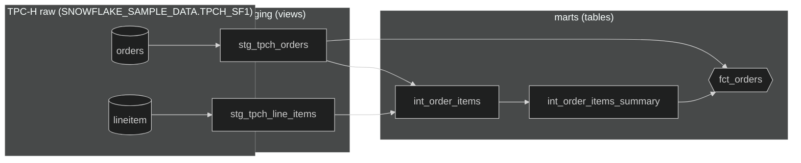
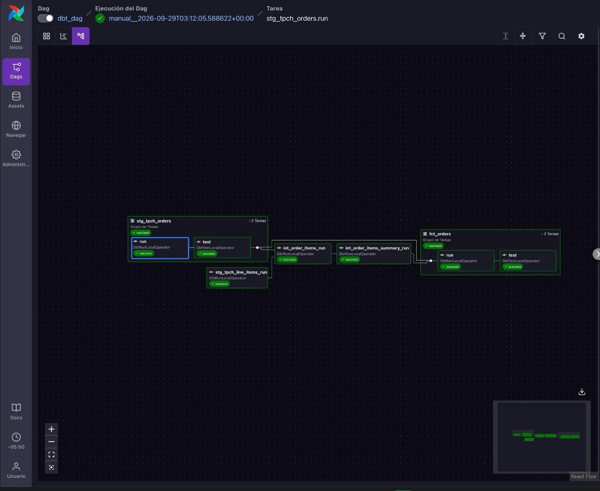

# data_pipeline

End-to-end data pipeline built with **dbt**, **Snowflake** and **Apache Airflow**, using the TPC-H sample dataset. The project transforms raw order and line item data into analytics-ready models that are orchestrated and tested automatically.

## Architecture

```
Snowflake (SNOWFLAKE_SAMPLE_DATA.TPCH_SF1)
        │  orders, lineitem
        ▼
   dbt · staging (views)
   stg_tpch_orders, stg_tpch_line_items
        │
        ▼
   dbt · marts (tables)
   int_order_items → int_order_items_summary → fct_orders
        │
        ▼
   Snowflake (dbt_db)  ◄── orchestrated by Apache Airflow + Astronomer Cosmos
```

- **Source:** `SNOWFLAKE_SAMPLE_DATA.TPCH_SF1` (`orders`, `lineitem`), sample data provided by Snowflake.
- **Staging:** column cleaning and renaming (`stg_tpch_orders`, `stg_tpch_line_items`), materialized as views.
- **Marts:** business models (`int_order_items`, `int_order_items_summary`, `fct_orders`), materialized as tables, with surrogate keys generated via `dbt_utils`.
- **Orchestration:** Airflow + [Astronomer Cosmos](https://astronomer.github.io/astronomer-cosmos/) runs the dbt project as a DAG, with a `run` + `test` task group per model.
- **Authentication:** service user (`dbt_svc`) with RSA key-pair auth, no password.

## How dbt transforms the data

Model lineage for the current state of the project: from the raw TPC-H tables, through staging views, to the marts tables.



## How it is orchestrated in Airflow

Cosmos turns each dbt model into Airflow tasks and respects the dependency graph: `stg_tpch_orders` (run → test) and `stg_tpch_line_items` first, then `int_order_items`, `int_order_items_summary`, and finally `fct_orders` (run → test).



## Stack

| Tool                            | Purpose                                        |
| ------------------------------- | ---------------------------------------------- |
| dbt Core (1.12) + dbt-snowflake | Data transformation, testing and documentation |
| dbt_utils                       | Generic tests and surrogate keys               |
| Snowflake                       | Data warehouse (trial account)                 |
| Apache Airflow (Astro CLI)      | Pipeline orchestration                         |
| Astronomer Cosmos               | Runs dbt projects as Airflow DAGs              |

## Project structure

```
dbt-dag/
├── dags/
│   ├── dbt_dag.py                     # Airflow DAG (Cosmos)
│   └── dbt/
│       └── data_pipeline/             # dbt project
│           ├── models/
│           │   ├── staging/
│           │   │   ├── stg_tpch_line_items.sql
│           │   │   ├── stg_tpch_orders.sql
│           │   │   └── tpch_sources.yml       # sources + tests
│           │   └── marts/
│           │       ├── fct_orders.sql
│           │       ├── int_order_items_summary.sql
│           │       ├── int_order_items.sql
│           │       └── generic_tests.yml      # tests on marts models
│           ├── macros/
│           ├── seeds/
│           ├── snapshots/
│           ├── tests/
│           ├── dbt_project.yml
│           └── packages.yml
├── images/                            # screenshots used in this README
├── include/
├── plugins/
├── tests/
├── Dockerfile
├── packages.txt
└── requirements.txt
```
